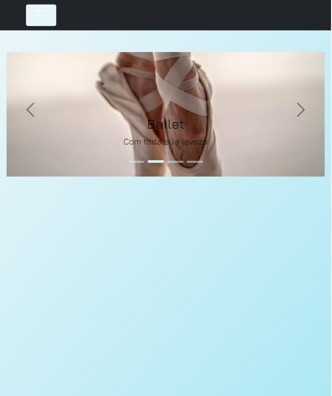

<div align="center">
  
  
</div>

# <div align="center"> Services Frontend </div>

#### <div align="right">- Projeto Finalizado🟢 <div>

### <div align="center"> Aplicação em Reactjs/Typescript, abordando conceitos sobre: </div>
- [TypeScript](https://www.typescriptlang.org/) - Tipagens
- [Reactjs](https://pt-br.reactjs.org/) - useState | useEffect e useReducer
- [React Router DOM](https://reactrouter.com/docs/en/v6/getting-started/overview) - Roteamento de páginas
- [React-bootstrap](https://react-bootstrap.github.io/) Componentes personalizados
- [Formik](https://formik.org/docs/overview) - Controle de formulários
- [Axios](https://axios-http.com/docs/intro) - obtendo dados da Api mockada
- [FakerJS](https://fakerjs.dev/) - Gerador de dados randômicos
- [Mock Service Worker](https://mswjs.io/) - Mock de Api
- [Jest](https://jestjs.io/pt-BR/) - Testes de integração de unitário
- [React testing library](https://testing-library.com/docs/react-testing-library/intro/) - Testes de hooks e screen de React
- [ESLint](https://eslint.org/) - linter para código
- [Prettier](https://prettier.io/) - formatador de código
- [Husky](https://typicode.github.io/husky/#/) - Capturar determinado momento de um commit
- [Lint-staged](https://github.com/okonet/lint-staged) - Executar ações em determinado momento de um commit

## <div align="center">Requisitos</div>
Para executar a aplicação é necessário instalar algumas ferramentas tais como um editor de códigos para realizar compilação dos mesmos. Nesse projeto foi utilizado o [Visual Studio Code](https://code.visualstudio.com/), [NodeJS](https://nodejs.org/en/) para compilação do código, [Git Bash](https://gitforwindows.org/) para baixar o repositório e baixar todas as dependências necessárias.

```bash
# Baixe o repositório.
$ git clone https://github.com/Ricnaga/services-frontend

# Acesse a pasta do projeto.
$ cd services-frontend

# Agora que baixou e acessou o repositório, vamos começar a instalação das dependências.
$ yarn ( caso não utilize o yarn execute apenas npm -i)

# Depois de instalado todas as dependências, abra a aplicação via vscode
$ code .

# Agore execute a aplicação.
$ yarn start (caso não utilize o yarn: npm run start)

# A aplicação iniciará na porta 3000
# No navegador digite: http://localhost:3000
```

<div align="center">Aplicação desenvolvida por minha pessoa.
Gostou? tem alguma sugestão de melhoria? por favor, entre em contato e ja aproveita e me adiciona.<br>
<a href="https://www.linkedin.com/in/ricardo-nagatomy"></a>
<a href="https://app.rocketseat.com.br/me/ricardo-nagatomy"></a>
</div>

#
<div align="center">  </div>
